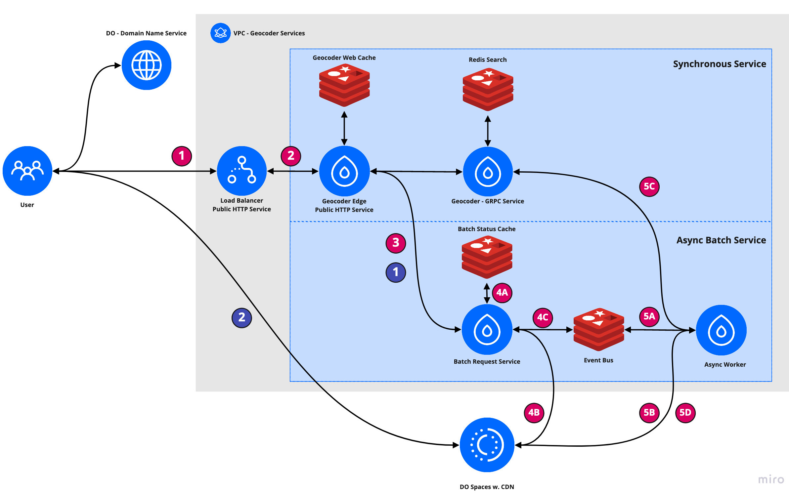

# Geocoding with Redis

A geocoder is a service for matching addresses to geographic locations and the entities containing those addresses. Geocoders use both geospatial queries and full text search to resolve a partial address to an address and location from a validated set of addresses.

For example, if a user wants to resolve the value `TIMES SQ MANHATTAN` to a proper address, a geocoding service may use a full text search algorithm to propose the following addresses:

- 5 TIMES SQUARE MANHATTAN 10036  , ( -73.98723, 40.755985 )
- 10 TIMES SQUARE MANHATTAN 10018 , ( -73.98687, 40.754963 )
- 11 TIMES SQUARE MANHATTAN 10036 , ( -73.98984, 40.756763 )

This application uses Redis Search and PubSub to provide both a synchronous and asynchronous batch geocoding service.

## Introduction Video


## Application Description



Please refer to service and database names in the [architecture pdf](https://github.com/DMW2151/gcaas/blob/main/_arch.pdf) while reading the following sub-sections. In the following examples I default to the commands relevant for **forward** geocoding unless specified. This application exposes syncronous and asyncronous functionality.

* The syncronous geocoding API is diagramed on page one of the PDF above. The API allows a user to submit 1 query address (identified by either location or address string) and recieve a list of scored, proposed, best-match addresses.
	
```bash
# Request
curl -XPOST https://gc.dmw2151.com/geocode/ \
	-d '{"method": "FWD_FUZZY", "max_results": 3, "query_addr": "ATLANTIC AVE BROOKLYN"}' 

# Response
{
  "result": [
    {
      "address": {
        "location": {
          "latitude": -73.909355,
          "longitude": 40.676468
        },
        "id": "address:50d17807-7dbd-41da-86c5-20c24f78ab36" 
      },
      "normed_confidence": 1,
      "full_street_address": "2111 ATLANTIC AVE BROOKLYN 11233"
    }
  ],
  "num_results": 1
}
```

* The asyncronous geocoding API is diagramed on page two of the PDF above. The API allows a user to submit a batch of addresses to the API and download a file with the best match from the validation set for each address in the query. The asyncronous geocoding API has two endpoints.

	* `/batch/` - Allows for the submission of a new batch of data.

	```bash
	# Request - Creates a New Batch w. Three Addresses
	curl -XPOST https://gc.dmw2151.com/batch/ \
		-d '{ 
			"method": "FWD_FUZZY", 
	        "query_addr": [
	                "ATLANTIC AVE BROOKLYN",
	                "WALL STREET MANHATTAN",
	                "509 MAIN ST",
	        ]
		}' 

	# Response - Acknowledges Batch Creation and Gives UUID for Status Updates
	{
		"id": "60f011eb-3817-4b67-abed-af4a9aa50623",
		"status": 1,
		"update_time": {
			"seconds": 1661575183,
			"nanos": 391420781
		}
	}
	```

	* `/batch/${BATCH_UUID}` - returns the status of the batch, if the batch is completed, the body will include a signed URL that can be used to download or share the results for several days.

	```bash
	# Request - Get Status
	curl -XGET https://gc.dmw2151.com/batch/60f011eb-3817-4b67-abed-af4a9aa50623

	# Response - Get Status -> OK 
	{
		"id": "60f011eb-3817-4b67-abed-af4a9aa50623",
		"status": 5, 
		"update_time": {
			"seconds": 1661575185,
			"nanos": 391420781
		}
		"download_path": "https://gcaas-data-storage.nyc3.digitaloceanspaces.com/datasets/...."
	}
	```

-------------

### How Data is Stored and Accessed

#### Syncronous Geocode Requests

* `Redis Search` - Stores validated addresses for our Geocoder, e.g. the superset of all possible results.

	* **Address** - A [HASH](https://redis.io/docs/data-types/hashes/) identified by `addressId` (e.g. `address:c24cf11b-79fb-4f78-a76b-7532c58a85ca`), containing fields for `composite_street_address` (e.g. `23 Wall Street, New York, NY 10005`) and `location` (e.g. `(-74.008827, 40.706005)`). 

		* Each address is stored during the initial data ingestion stage (see: `Management Service`) with a command similar to the following.

		```bash
		HSET address:${ADDRESS_UUID} location "(-74.008827, 40.706005)" composite_street_addr "23 Wall Street, New York, NY 10005"
		```

	* **Index** - An [Index](https://redis.io/docs/stack/search/quick_start/#create-an-index) of all `address:*` hashes. 

		* The index is created on server initialization with the following command.

		```bash
		FT.CREATE addr-idx ON HASH PREFIX 1 "address:" NOHL NOOFFSETS LANGUAGE "english" SCHEMA location GEO composite_street_address TEXT SORTABLE
		```

		* The `Geocoder GRPC Service` accesseses the index (and addresses) on each API call. When `Geocoder GRPC Service` recieves a request from `Geocoder Edge`, the HTTP request parameters populate a search similar to the following.

		```bash
		# Forward Geocode Request :: Address -> Fuzzy Match -> (Address, Location)
		FT.SEARCH addr-idx "@composite_street_address:${REQUEST_ADDR}" WITHSCORES LANGUAGE "english" SCORER TFIDF.DOCNORM LIMIT 0 ${REQUEST_MAX_RESULTS}

		# Reverse Geocode Request :: Point -> Geo Query -> (Address, Location)
		FT.SEARCH addr-idx "@location:[${REQUEST_LNG} ${REQUEST_LAT} 1024 m]" WITHSCORES LIMIT 0 ${REQUEST_MAX_RESULTS}
		```


* `Geocoder Web Cache` - Temporarily stores the responses of recent Geocoder API calls. Prevents duplicate requests from hitting `Redis Search` in a short window.

	* **Request Key** - A deterministically-generated request key is stored as a [STRING](https://redis.io/docs/data-types/strings/). In practice, the key is simply a concatenation of the request parameters (e.g. `FWD_GEOCODE:WALL_STREET_NY:5`). The value of the key is the string representation of the query response. 

		* The request key is set following each successful API call to `Geocoder Edge` with a command similar to the following.

		```bash
		# Forward Request
		SET FWD_GEOCODE:WALL_STREET_NY:5: '{"result": [...], "num_results": 5}' EX 15
		```

		* The request key is accessed during each API call to `Geocoder Edge` with a command similar to the following. Note, for un-cached results, this query will return no data.

		```bash
		GET FWD_GEOCODE:WALL_STREET_NY:5
		```

#### Asyncronous Geocode Requests

The asyncronous geocoding API makes requests through `Geocoder Edge` and uses `Redis Search` to handle address resolution. However, because this service is meant to provide precise updates on batch status, results are **NOT** cached in `Geocoder Web Cache`. In this section, I will detail the services and data structures unique to this API.


* `Batch Status Cache` - Treated as a status reference by `Batch Status Service`, this instance stores information about batches:

	* **BatchStatus** - A [HASH](https://redis.io/docs/data-types/hashes/) identified by `batch_uuid` (e.g. `60f011eb-3817-4b67-abed-af4a9aa50623`), containing fields for `status` (e.g. `BatchGeocodeStatus_ACCEPTED`, `BatchGeocodeStatus_SUCCESS`), `download_path`, and `update_time`. 

		* A new BatchStatus is created on a valid request to `https://gc.dmw2151.com/batch/`. The command to do so is similar to the following:

		```bash
		# Create Initial Batch Data - No Donwload Path Set on Initialization
		HSET ${BATCH_UUID} status "BatchGeocodeStatus_ACCEPTED" download_path "" update_time ${CURRENT_TIME}
		```

		* The BatchStatus is updated by a background process that recieves updates from `Event Bus`, these updates are sent by `Async Worker` and can indicate a request has finished, failed validation, been canceled, etc.

		```bash
		# If a `success` message is recieved from `Event Bus` -> Set Success
		HSET ${BATCH_UUID} status "BatchGeocodeStatus_SUCCESS" download_path ${A_LONG_SIGNED_URL} update_time ${CURRENT_TIME}
		```

		* The BatchStatus is accessed on a request to `https://gc.dmw2151.com/batch/${BATCH_UUID}` with a request like the below:

		```bash
		HMGET ${BATCH_UUID} status download_path update_time
		```

* `Event Bus` - Used for Pub/Sub - messages are sent between `Batch Status Service` and `Async Worker`. In practice, this instance maintains two channels.

	* **batch.creates** - A channel that `Batch Status Service` publishes on and `Async Worker` subscribes to. This channel contains the `batch_uuid`s of new batches.

		* A new message is created after `Batch Status Service` has a new file available for `Async Worker` to pick up. This channel only communicates the UUID of the new create, the command used to publish is similar to the following:

		```bash
		PUBLISH batch.creates ${BATCH_UUID}
		```

		* On initialization, `Async Worker` runs the following command to access future messages

		```bash
		SUBSCRIBE batch.creates
		```

	* **batch.status** - A channel that `Async Worker` publishes on and `Batch Status Service` subscribes to. This channel sends messages with the same schema as BatchStatus (as described in the `Batch Status Cache` section). However, instead of sending a hash, `Async Worker` sends a protobuf  representation of the BatchStatus object.

		*  `Async Worker` sends a message on this channel following any meaningful event in the batch geocoding process. 

		```bash
		PUBLISH batch.status ${A_PROTO_REPRESENTATION_OF_BATCHSTATUS}
		```

		* On initialization, `Batch Status Service` runs the following command to access future messages

		```bash
		SUBSCRIBE batch.status
		```

### Performance Benchmarks

This is a new application, so there are no prior benchmarks. I ran the following quick tests against the synchronous 
endpoint, `https://gc.dmw2151.com/geocode/` while the New York City 1M dataset was loaded into the search instance. With low load on the system, the request resolves almost immediately (\~80ms)

```bash
curl -w "@timing-fmt.txt" -o /dev/null -s https://gc.dmw2151.com/geocode \
	-d '{"method": "FWD_FUZZY", "max_results": 3, "query_addr": "ATLANTIC AVE BROOKLYN"}'  

       timmelookup:  0.006658s
      time_connect:  0.028724s
   time_appconnect:  0.056905s
  time_pretransfer:  0.056950s
     time_redirect:  0.000000s
time_starttransfer:  0.080518s
                     ----------
        time_total:  0.080624s
```

To simulate a higher load situation, I created a list of 1000 UNIQUE partial addresses samples from the New York City 1M datset to send to the FWD geocoding endpoint. I sent these over the wire with parallelism == 8 and found that the API did slow down a bit, but is still in an acceptable range.

```bash
time (cat nyc_address_sample.txt |\
	xargs -P 8 -I % curl -o /dev/null -s https://gc.dmw2151.com/geocode/ -d '{"method": "FWD_FUZZY", "max_results": 3, "query_addr": "%I"}')

# (21.875 seconds * 8 clients ) / 1000 requests -> ~175ms / request
15.32s user 9.30s system 112% cpu 21.875 total
```

However, I would strongly discourage this usage of the synchronous API in this way. It is meant for one off requests, the asynchronous service delivers a better product experience for users who want to geocode dozens or hundreds of locations. For more comments on performance, you can refer to the video associated with this project.


## Running Locally

### Prerequisites

These instructions were tested on a machine with the following software. Any modern MacOS (M1 or X86) or other Unix based machine should be able to follow these instructions without issue.

- docker -> `Docker version 20.10.14, build a224086`
- docker-compose -> `docker-compose version 1.29.2`
- docker-desktop -> `4.11.1 (84025)`
- go -> `go version go1.18.5 darwin/amd64`
- kernel info -> `21.5.0 Darwin Kernel Version 21.5.0: Tue Apr 26 21:08:22 PDT 2022; root:xnu-8020.121.3~4/RELEASE_X86_64 x86_64`


### Local Installation

#### Section 1 - Deploying Services

Local installation does not involve deploying any paid resources to a cloud or accessing any resources from `gc.dmw2151.com`. However, it does require building and pulling all containers used in the project. I've built very lightweight service images, but machines with <4GB of RAM to allocate to Docker may struggle a bit on build ( *Estimated Time: 1 - 3 minutes*)

- Change directories to `./deploy-development` and run `docker-compose up`. On the first run, this will build all containers associated with the project. Once the build has finished, you should be able to run `docker stats` and see each of the following containers' resource usage. You can also run `docker ps` to see the ports that are exposed from the application to our `localhost`. If you'd like to tail the logs while you send requests to the service, you can also run `docker compose logs --follow` (highly recommended)

```bash
# Result of `docker stats`
CONTAINER ID   NAME                                  CPU %     MEM USAGE / LIMIT     MEM %     NET I/O           BLOCK I/O     PIDS                                                                                                    
0671cdfe9e79   deploy-development_insight_1          0.04%     84.71MiB / 3.842GiB   2.15%     8.59kB / 3.69kB   0B / 9.4MB    9                                    
e5d70506fe54   deploy-development_gcaas-edge_1       0.00%     16.69MiB / 3.842GiB   0.42%     7.84kB / 5.93kB   12.7MB / 0B   7                                       
3d118f6c80c3   deploy-development_gcaas-batch_1      0.14%     18MiB / 3.842GiB      0.46%     12.5kB / 14.6kB   14.6MB / 0B   7                                        
5350f9bee4e6   deploy-development_gcaas-worker_1     0.07%     16.43MiB / 3.842GiB   0.42%     9.28kB / 11.3kB   13.3MB / 0B   6                                         
22971f9a1fd4   deploy-development_gcaas-mgmt_1       0.00%     15.16MiB / 3.842GiB   0.39%     2.66kB / 370B     12MB / 0B     7                                       
037e6a3ac6eb   deploy-development_gcaas-geocoder_1   0.00%     15.6MiB / 3.842GiB    0.40%     5.54kB / 3.42kB   12.4MB / 0B   6                                           
2839c5f4e537   deploy-development_edge-cache_1       0.16%     2.328MiB / 3.842GiB   0.06%     3.13kB / 297B     0B / 0B       5                                       
3ce695bbf297   deploy-development_pubsub_1           0.17%     2.379MiB / 3.842GiB   0.06%     25.3kB / 13.8kB   0B / 0B       5                                    
ea7addd728e5   deploy-development_search_1           3.22%     23.45MiB / 3.842GiB   0.60%     3.82kB / 731B     9.7MB / 0B    27                                   
4699cbf81461   deploy-development_batch-cache_1      0.16%     3.117MiB / 3.842GiB   0.08%     3.33kB / 434B     3.17MB / 0B   5
```

```bash
# Result of `docker ps`
CONTAINER ID   IMAGE                               COMMAND                  CREATED          STATUS          PORTS                      NAMES                       
0bb1faf8ddc4   deploy-development_gcaas-edge       "/cmd/edge/edge ' --…"   8 seconds ago    Up 7 seconds    0.0.0.0:2151->2151/tcp     deploy-development_gcaas-edge_1
b31daee0688f   redislabs/redisinsight:latest       "bash ./docker-entry…"   9 seconds ago    Up 8 seconds    0.0.0.0:8001->8001/tcp     deploy-development_insight_1                                                                   
bf4ed04049c3   deploy-development_gcaas-geocoder   "/cmd/geocoder/geoco…"   9 seconds ago    Up 8 seconds    0.0.0.0:50051->50051/tcp   deploy-development_gcaas-geocoder_1
3e35bcfaf658   deploy-development_gcaas-mgmt       "/cmd/mgmt/mgmt ' --…"   9 seconds ago    Up 8 seconds    0.0.0.0:50052->50052/tcp   deploy-development_gcaas-mgmt_1                                                                
3d118f6c80c3   deploy-development_gcaas-batch      "/cmd/batch/batch ' …"   7 minutes ago    Up 7 minutes    0.0.0.0:50053->50053/tcp   deploy-development_gcaas-batch_1
5350f9bee4e6   deploy-development_gcaas-worker     "/cmd/worker/worker …"   7 minutes ago    Up 7 minutes                               deploy-development_gcaas-worker_1
172dbac9549f   redislabs/redismod:latest           "redis-server --load…"   10 seconds ago   Up 10 seconds   6379/tcp                   deploy-development_search_1
2839c5f4e537   redis:alpine3.16                    "docker-entrypoint.s…"   7 minutes ago    Up 7 minutes    6379/tcp                   deploy-development_edge-cache_1
3ce695bbf297   redis:alpine3.16                    "docker-entrypoint.s…"   7 minutes ago    Up 7 minutes    6379/tcp                   deploy-development_pubsub_1
4699cbf81461   redis:alpine3.16                    "docker-entrypoint.s…"   7 minutes ago    Up 7 minutes    6379/tcp                   deploy-development_batch-cache_1
```

- To confirm that all is up and running, send a test request to `http://localhost:2151/geocode`. Because we haven't seeded our dataset with any data, we expect the following request to return an empty response.


```bash
# Request - Test Request to Confirm Edge Service is Running - Should Return No Data, but show HTTP Status 200
curl -i -XPOST http://localhost:2151/geocode/ \
	-d '{"method": "FWD_FUZZY", "max_results": 1, "query_addr": "ATLANTIC AVE"}' 
HTTP/1.1 200 OK
```

#### Section 2 - Seeding the Location Index

In the local deployment configuration, `Geocoder Edge` is served on `:2151` and exposed to the host. In production, **ONLY** this service is available to the outside world. The local configuration for this application exposes a service called `GCAAS Management` on `:50051`. This service is used by the developer (me) to manage the data available in the production. In this step, we'll seed the location index by sending data through `GCAAS Management`.

This application could accept any dataset of addresses provided they met the ingestion criteria. For the time being, we'll use a dataset I'll refer to as `NYC Addresses 1M`. This [dataset](https://www.google.com/url?sa=t&rct=j&q=&esrc=s&source=web&cd=&cad=rja&uact=8&ved=2ahUKEwjM3PeE7Of5AhVpKlkFHRkqCkMQFnoECBQQAQ&url=https%3A%2F%2Fdata.cityofnewyork.us%2FCity-Government%2FNYC-Address-Points%2Fg6pj-hd8k&usg=AOvVaw2XeK_R5WgxJoP6Fjq61GZ1) contains 967,000 address points from New York City.

To download the NYC address dataset, change directories to `./misc/data-processing` and run `bash ./download-nyc.sh`. This script downloads and processes the raw NYC address data into a format that `GCAAS Mangement` accepts. (*Estimated Time: 1 - 2 minutes*)

You can inspect the first few rows of the cleaned dataset, `./misc/data-processing/_data/prepared_nyc.csv` with the following:

```bash
# Get first few rows of ingestion dataset
head -n 10 ./_data/prepared_nyc.csv 
```

```csv
ADDRESS_ID,the_geom,H_NO FULL_STREE BOROCODE NEW YORK ZIPCODE                                                                               
3066687,POINT (-73.94890840262882 40.681024605257534),54 MACON ST BROOKLYN NEW YORK 11216                                                                                  
3064205,POINT (-73.94867469809614 40.6862985441319),438 GATES AVE BROOKLYN NEW YORK 11216
3063204,POINT (-73.95302508854085 40.6880523616944),442 GREENE AVE BROOKLYN NEW YORK 11216
3065757,POINT (-73.94380067421258 40.68347876343482),411 TOMPKINS AVE BROOKLYN NEW YORK 11221
3066531,POINT (-73.9422673814714 40.682519773924874),290 HALSEY ST BROOKLYN NEW YORK 11216
3054846,POINT (-73.9386413566232 40.68971323068642),742 GREENE AVE BROOKLYN NEW YORK 11221
3060301,POINT (-73.94438289946332 40.699143336060835),176 THROOP AVE BROOKLYN NEW YORK 11206
3060994,POINT (-73.9445761259967 40.69528388494299),185 VERNON AVE BROOKLYN NEW YORK 11206
3062642,POINT (-73.95194963018604 40.68967344199405),574 LAFAYETTE AVE BROOKLYN NEW YORK 11205
```

I've provided a short script, `./geocoder-svc/cmd/seed-address-dataset/main.go`, that can be used to populate the location index. If you do not have Go installed, please run through the [installation guide](https://go.dev/doc/install) for your OS. To run this script, change directories into `./geocoder-svc/cmd/seed-address-dataset/`and run the following:

```bash
go run . --rpc-server localhost --rpc-server-port 50052 --file ./../../../misc/data-processing/_data/prepared_nyc.csv
```

The above command calls the management server and streams the contents of `./../../../misc/data-processing/_data/prepared_nyc.csv` into Redis (*Estimated Time: <1 minute*)


Finally, we can retry the query that previously returned no results. 

```bash
# Request
curl -i -XPOST http://localhost:2151/geocode/ -d '{"method": "FWD_FUZZY", "max_results": 1, "query_addr": "ATLANTIC AVE"}'
HTTP/1.1 200 OK
Access-Control-Allow-Origin: *
Content-Type: application/json
Date: Sat, 27 Aug 2022 21:22:31 GMT
Content-Length: 208

# Response
{
  "result": [
    {
      "address": {
        "id": "address:3043414",
        "location": {
          "latitude": -73.932465,
          "longitude": 40.67734
        }
      },
      "normed_confidence": 1,
      "composite_street_address": "1748 ATLANTIC AVE BROOKLYN NEW YORK 11213"
    }
  ],
  "num_results": 1
}
```


#### Section 3 - Using Redis Insights

Now that we have a working service that's reading from the `Redis Search` instance, we should understand how its performing. The local configuration runs Redis Insights on `:8001`. You can visit the local insights instance on localhost [here](http://localhost:8001). You can connect to profile the search instance using the parameters shown below:


## Deployment

This application does not provide a quick deploy option, please refer to the local installation section for discussion on how to test the app


## TODO

There are some weaknesses in this service right now, the following would improve user experience, performance, etc.

* Set Memory Limits - In the current configuration, different instances have different resource requirements, the application's deployment could be safer if these were scoped and defined.

* Backpressure / Retries - In the current application, there's minimal logic for retries, timed backoffs, etc. In short, the properties you'd write into a resilient distributed system aren't present.

* High Availability - The application is not deployed for HA. Because we run on a single node, we've got every service sharing the same underlying pool of resources, there is no redundancy, etc. A proper deployment of this service would involve migrating to either DigitalOcean's K8s offering, or a self-hosted Consul + Nomad deployment.

* Open API Specificaiton - The API behavior is not well documented to the public. [Open API](https://swagger.io/specification/) is a specificattion that makes documenting services easier, but I haven't yet written this spec.

* Datasets - The service is designed to handle *any* dataset with id, location, and address. There are quite a few national datasets available that could be interesting, e.g. [NAD](https://www.transportation.gov/gis/national-address-database/national-address-database-nad-disclaimer).
